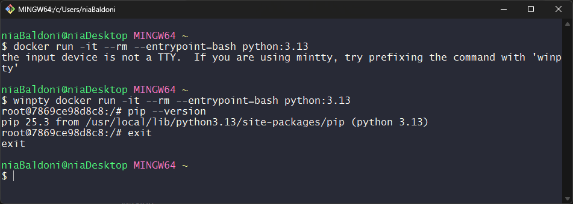
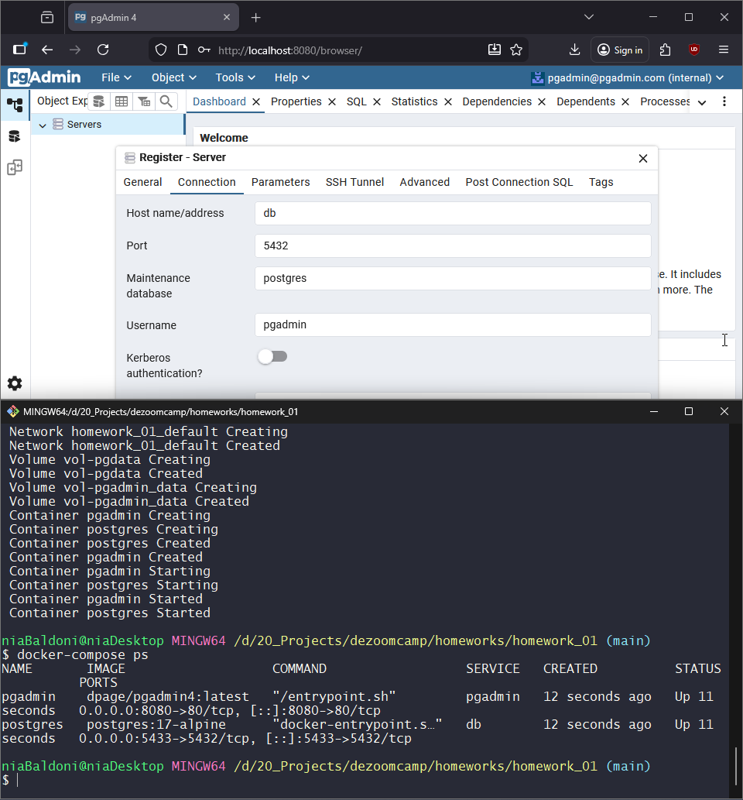
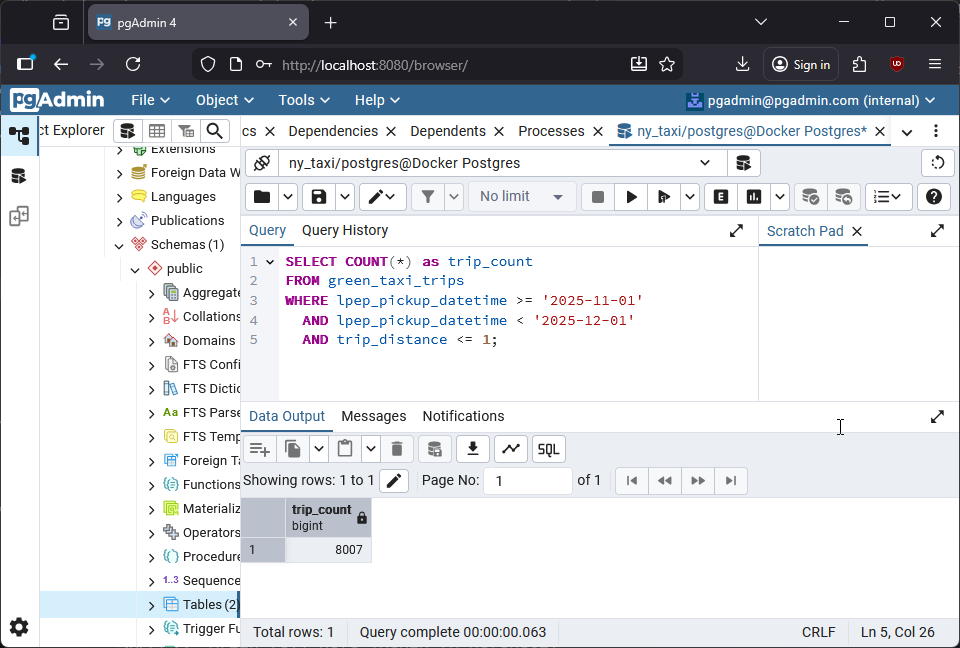
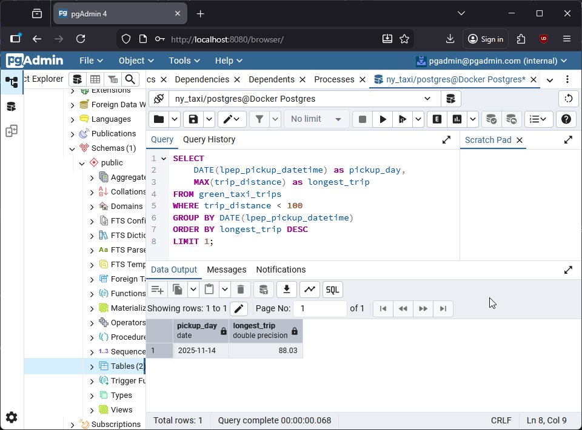
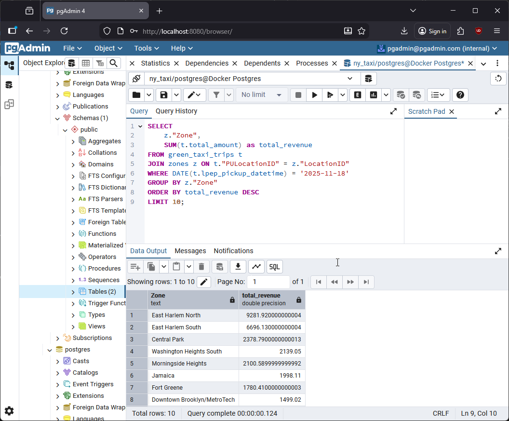
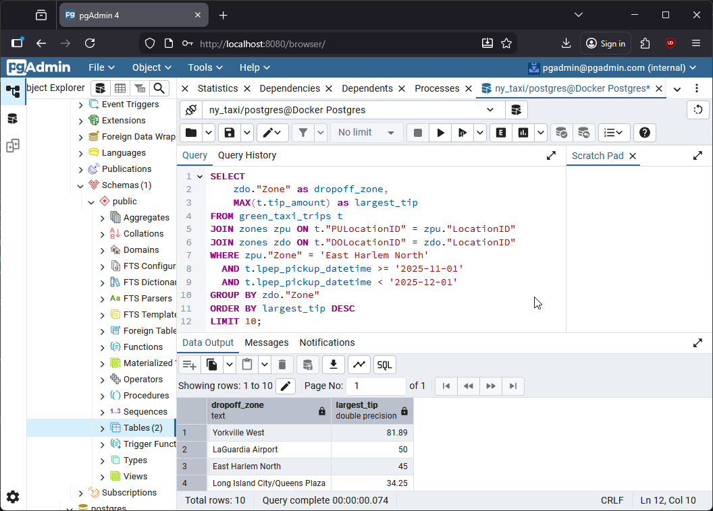

# Homework 1: Docker, SQL and Terraform

- [Question 1](#question-1-understanding-docker-images)
- [Question 2](#question-2-understanding-docker-networking-and-docker-compose)
- [Question 3](#question-3-counting-short-trips)
- [Question 4](#question-4-longest-trip-for-each-day)
- [Question 5](#question-5-biggest-pickup-zone)
- [Question 6](#question-6-largest-tip)
- [Question 7](#question-7-terraform-workflow)

## Question 1. Understanding Docker images

> Run docker with the `python:3.13` image. Use an entrypoint `bash` to interact with the container.
> What's the version of `pip` in the image?
> - 25.3
> - 24.3.1
> - 24.2.1
> - 23.3.1

### Answer

We run the command `winpty docker run -it --rm --entrypoint=bash python:3.13` (for this homework I'm using Git Bash on Windows, so I have to use `winpty` to enable the interactive terminal as Git Bash doesn't properly handle TTY allocation). Once in the container, we can use the command `pip --version` to check the version of `pip` in the `python:3.13` image.

```bash
    $ winpty docker run -it --rm --entrypoint=bash python:3.13
    root@7869ce98d8c8:/# pip --version
    pip 25.3 from /usr/local/lib/python3.13/site-packages/pip (python 3.13)
    root@7869ce98d8c8:/# exit
    exit
```



As we can see from the output of the command, the answer is **25.3**.

## Question 2. Understanding Docker networking and docker-compose

> Given the following `docker-compose.yaml`, what is the `hostname` and `port` that pgadmin should use to connect to the postgres database?

```yaml
services:
  db:
    container_name: postgres
    image: postgres:17-alpine
    environment:
      POSTGRES_USER: 'postgres'
      POSTGRES_PASSWORD: 'postgres'
      POSTGRES_DB: 'ny_taxi'
    ports:
      - '5433:5432'
    volumes:
      - vol-pgdata:/var/lib/postgresql/data

  pgadmin:
    container_name: pgadmin
    image: dpage/pgadmin4:latest
    environment:
      PGADMIN_DEFAULT_EMAIL: "pgadmin@pgadmin.com"
      PGADMIN_DEFAULT_PASSWORD: "pgadmin"
    ports:
      - "8080:80"
    volumes:
      - vol-pgadmin_data:/var/lib/pgadmin

volumes:
  vol-pgdata:
    name: vol-pgdata
  vol-pgadmin_data:
    name: vol-pgadmin_data
```

> 
> - postgres:5433
> - localhost:5432
> - db:5433
> - postgres:5432
> - db:5432
> 
> If multiple answers are correct, select any 

### Answer

This `docker-compose` config file creates two Docker containers:

- one container named `postgres`, which will host the PostgreSQL database `db`; it maps the host port `5433` to the container port `5432`
- one container named `pgadmin`, which will host the Web UI for easier managing of the db; it maps the host port `8080` to the container port `80`

When containers communicate within the same docker-compose network, they use service names for hostname, and internal container ports (not host-mapped ports). Using the container name `postgres` is also correct, but it's good practice to use the service name.

So, in this situation, `pgadmin` must connect to hostname `db` and port `5432` - the right answer is **db:5432**.

I verified this by successfully connecting pgAdmin to PostgreSQL using these credentials.



## Question 3. Counting short trips

> For the trips in November 2025 (lpep_pickup_datetime between '2025-11-01' and '2025-12-01', exclusive of the upper bound), how many trips had a `trip_distance` of less than or equal to 1 mile?
> - 7,853
> - 8,007
> - 8,254
> - 8,421

### Answer

We write the query

```SQL
    SELECT COUNT(*) as trip_count
    FROM green_taxi_trips
    WHERE lpep_pickup_datetime >= '2025-11-01'
    AND lpep_pickup_datetime < '2025-12-01'
    AND trip_distance <= 1;
```

and the result was **8007**.



## Question 4. Longest trip for each day

> Which was the pick up day with the longest trip distance? Only consider trips with `trip_distance` less than 100 miles (to exclude data errors).
> Use the pick up time for your calculations.
> - 2025-11-14
> - 2025-11-20
> - 2025-11-23
> - 2025-11-25

### Answer

We write the query

```SQL
    SELECT 
        DATE(lpep_pickup_datetime) as pickup_day,
        MAX(trip_distance) as longest_trip
    FROM green_taxi_trips
    WHERE trip_distance < 100
    GROUP BY DATE(lpep_pickup_datetime)
    ORDER BY longest_trip DESC
    LIMIT 1;
```

The day with the longest trip distance seem to be **2025-11-14**, with a trip that was around 88 miles long.



## Question 5. Biggest pickup zone

> Which was the pickup zone with the largest `total_amount` (sum of all trips) on November 18th, 2025?
> - East Harlem North
> - East Harlem South
> - Morningside Heights
> - Forest Hills

### Answer

```SQL
SELECT 
    z."Zone",
    SUM(t.total_amount) as total_revenue
FROM green_taxi_trips t
JOIN zones z ON t."PULocationID" = z."LocationID"
WHERE DATE(t.lpep_pickup_datetime) = '2025-11-18'
GROUP BY z."Zone"
ORDER BY total_revenue DESC
LIMIT 10;
```

With this query, we get the answer: **East Harlem North**, with almost $9282, collected the most money that day.



## Question 6. Largest tip

> For the passengers picked up in the zone named "East Harlem North" in November 2025, which was the drop off zone that had the largest tip?
> Note: it's `tip` , not `trip`. We need the name of the zone, not the ID.
> - JFK Airport
> - Yorkville West
> - East Harlem North
> - LaGuardia Airport

### Answer

We write the query

```SQL
SELECT 
    zdo."Zone" as dropoff_zone,
    MAX(t.tip_amount) as largest_tip
FROM green_taxi_trips t
JOIN zones zpu ON t."PULocationID" = zpu."LocationID"
JOIN zones zdo ON t."DOLocationID" = zdo."LocationID"
WHERE zpu."Zone" = 'East Harlem North'
  AND t.lpep_pickup_datetime >= '2025-11-01'
  AND t.lpep_pickup_datetime < '2025-12-01'
GROUP BY zdo."Zone"
ORDER BY largest_tip DESC
LIMIT 10;
```

and it looks like the drop off zone that had the largest tip was **Yorkville West**, with an impressive tip of $81.89.



## Question 7. Terraform Workflow

> Which of the following sequences, respectively, describes the workflow for:
> 1. Downloading the provider plugins and setting up backend,
> 2. Generating proposed changes and auto-executing the plan
> 3. Remove all resources managed by terraform`
> 
> Answers:
> - terraform import, terraform apply -y, terraform destroy
> - teraform init, terraform plan -auto-apply, terraform rm
> - terraform init, terraform run -auto-approve, terraform destroy
> - terraform init, terraform apply -auto-approve, terraform destroy
> - terraform import, terraform apply -y, terraform rm

### Answer

The correct workflow sequence is:

**terraform init, terraform apply -auto-approve, terraform destroy**

- `terraform init` - Initializes the working directory, downloads required provider plugins (e.g., GCP provider), and sets up the backend for state management
- `terraform apply -auto-approve` - Generates the execution plan showing proposed infrastructure changes and automatically applies them without requiring manual approval (the `-auto-approve` flag skips the confirmation prompt)
- `terraform destroy` - Removes all infrastructure resources that are managed by Terraform, cleaning up the cloud resources

The other options are incorrect: `terraform import` is for importing existing resources, not initialization; `terraform plan -auto-apply` doesn't exist (plan only shows changes, doesn't apply them); `terraform run` and `terraform rm` do not exist; and, finally, `-y` is not a valid Terraform flag.