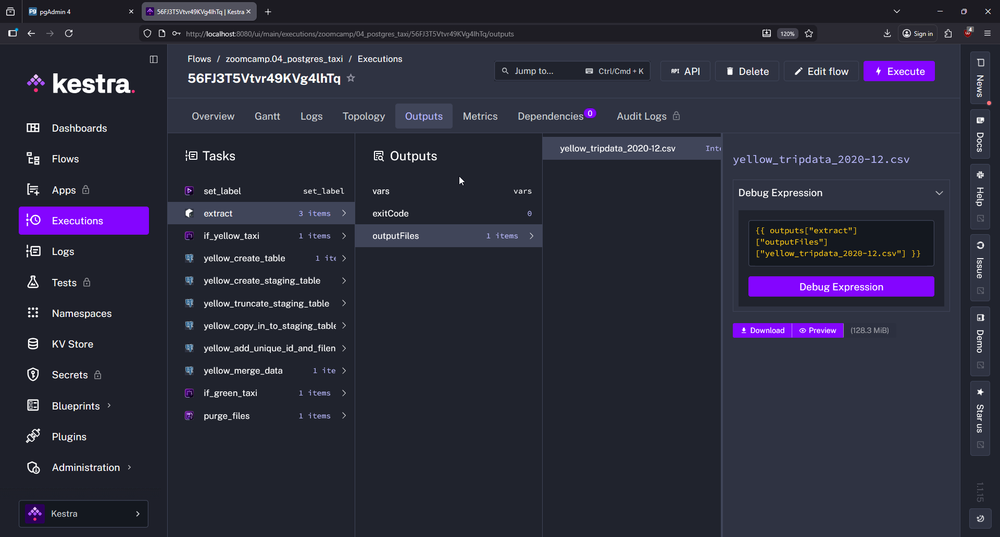
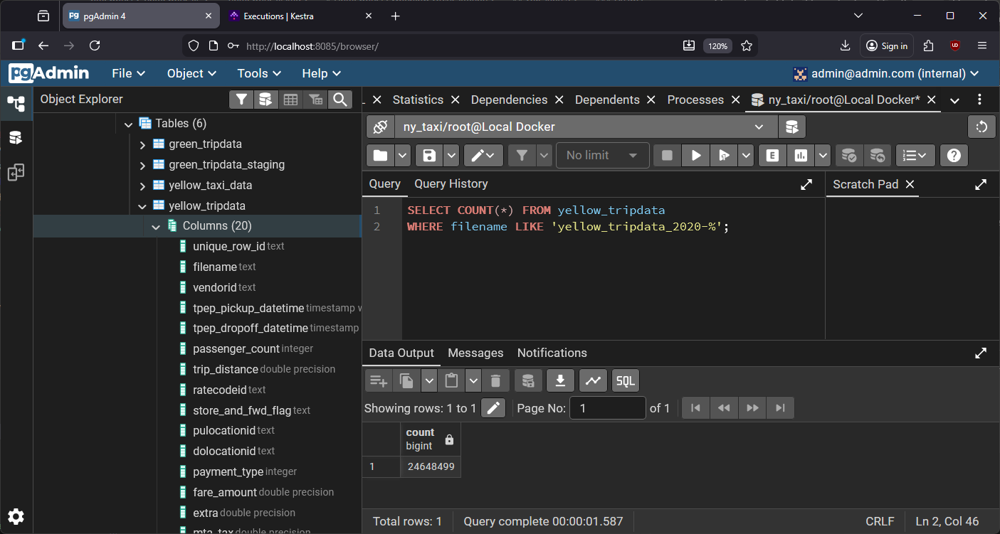
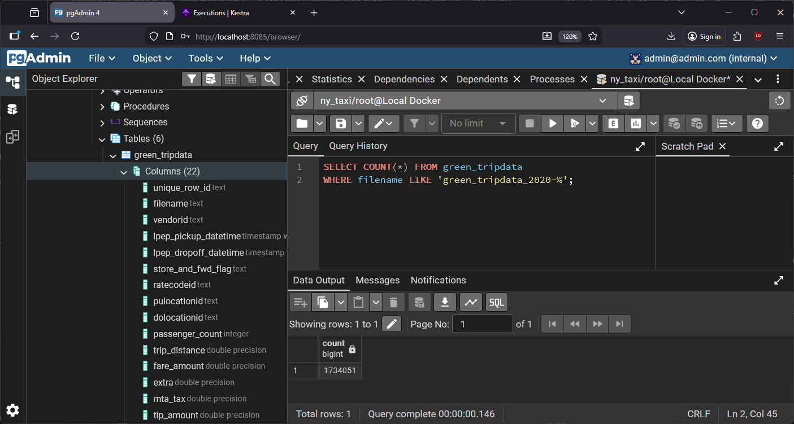
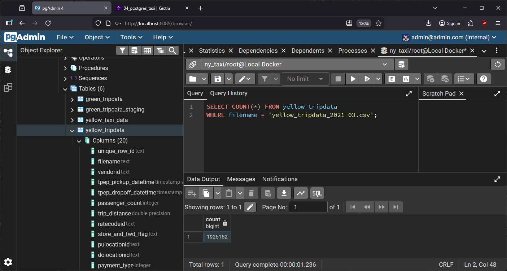

# Homework 2: Workflow Orchestration

- [Question 1](#question-1)
- [Question 2](#question-2)
- [Question 3](#question-3)
- [Question 4](#question-4)
- [Question 5](#question-5)
- [Question 6](#question-6)

## Question 1

> Within the execution for `Yellow` Taxi data for the year `2020` and month `12`: what is the uncompressed file size (i.e. the output file `yellow_tripdata_2020-12.csv` of the `extract` task)?
> - 128.3 MiB
> - 134.5 MiB
> - 364.7 MiB
> - 692.6 MiB

### Answer

I ran the flow `04_postgres_taxi.yaml` with inputs as follows:

- Taxi: `yellow`
- Year: `2020`
- Month: `12`

As the flow was executing, I moved to the Outputs tab, looked at the extract task, and in outputFiles I saw the file size: **128.3MiB**.



## Question 2

> What is the rendered value of the variable `file` when the inputs `taxi` is set to `green`, `year` is set to `2020`, and `month` is set to `04` during execution?
> - `{{inputs.taxi}}_tripdata_{{inputs.year}}-{{inputs.month}}.csv` 
> - `green_tripdata_2020-04.csv`
> - `green_tripdata_04_2020.csv`
> - `green_tripdata_2020.csv`

### Answer

We have defined the variable `file` in the code as follows:

```yaml
    variables:
        file: "{{inputs.taxi}}_tripdata_{{inputs.year}}-{{inputs.month}}.csv"
```

So, when the inputs are set to:

- Taxi: `green`
- Year: `2020`
- Month: `04`

we just have to substitute `{{inputs.taxi}}` with `green`, `{{inputs.year}}` with `2020` and `{{inputs.month}}` with `04`. The resulting string will be **`green_tripdata_2020-04.csv`**.

## Question 3

> How many rows are there for the `Yellow` Taxi data for all CSV files in the year 2020?
> - 13,537.299
> - 24,648,499
> - 18,324,219
> - 29,430,127

### Answer

After making sure we have backfilled the Yellow Taxi data for the year 2020 in our PostgreSQL database using Kestra, we can query the database as follows:

```SQL
    SELECT COUNT(*) FROM yellow_tripdata 
    WHERE filename LIKE 'yellow_tripdata_2020-%';
```

The response of this query tells us that there are a total of **24,648,499 rows** for the year 2020.



## Question 4

> How many rows are there for the `Green` Taxi data for all CSV files in the year 2020?
> - 5,327,301
> - 936,199
> - 1,734,051
> - 1,342,034

### Answer

Similarly to the previous question, we make sure that we have backfilled the Green Taxi data for the year 2020. Afterwards, we once again query the database:

```SQL
    SELECT COUNT(*) FROM green_tripdata 
    WHERE filename LIKE 'green_tripdata_2020-%';
```

The response tells us that there are **1,734,051 rows** for the year 2020.



## Question 5

> How many rows are there for the `Yellow` Taxi data for the March 2021 CSV file?
> - 1,428,092
> - 706,911
> - 1,925,152
> - 2,561,031

### Answer

After making sure we have backfilled the Yellow Taxi data for the year 2021, we query the database once again.

```SQL
    SELECT COUNT(*) FROM yellow_tripdata 
    WHERE filename = 'yellow_tripdata_2021-03.csv';
```

The answer is: **1,925,152 rows** for Yellow Taxi data for March 2021.




## Question 6

> How would you configure the timezone to New York in a Schedule trigger?
> - Add a `timezone` property set to `EST` in the `Schedule` trigger configuration  
> - Add a `timezone` property set to `America/New_York` in the `Schedule` trigger configuration
> - Add a `timezone` property set to `UTC-5` in the `Schedule` trigger configuration
> - Add a `location` property set to `New_York` in the `Schedule` trigger configuration  

### Answer

The correct answer is: **Add a `timezone` property set to `America/New_York` in the `Schedule` trigger configuration**.

Kestra uses IANA timezone database format (like `America/New_York` or `Europe/Stockholm`) for timezone configuration. This format automatically handles daylight saving time transitions, unlike abbreviations like `EST` or fixed UTC offsets like `UTC-5`.

Example:
```yaml
triggers:
  - id: ny_schedule
    type: io.kestra.plugin.core.trigger.Schedule
    cron: "0 9 * * *"
    timezone: America/New_York
```