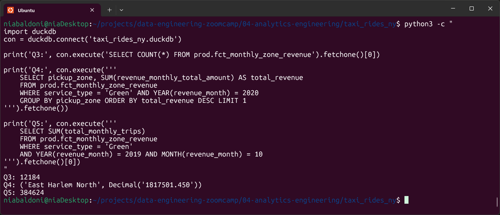
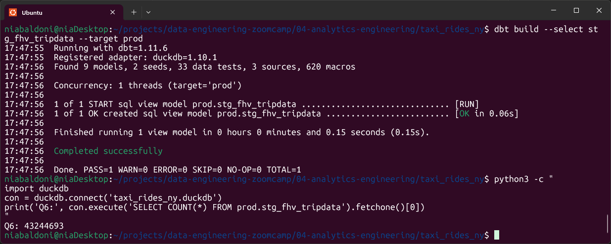

# Homework 2: Workflow Orchestration

- [Question 1](#question-1)
- [Question 2](#question-2)
- [Question 3](#questions-3-4-and-5)
- [Question 4](#questions-3-4-and-5)
- [Question 5](#questions-3-4-and-5)
- [Question 6](#question-6)

## Question 1

### Answer

- int_trips_unioned only

dbt run --select int_trips_unioned selects exactly that model and nothing else. If I wanted dbt to also run its upstream dependencies, I'd write dbt run --select +int_trips_unioned (the + prefix means "and everything upstream"). Downstream would be int_trips_unioned+.

## Question 2

### Answer

- dbt will fail the test, returning a non-zero exit code

The accepted_values test works by running a query that looks for any rows where the value is not in your allowed list. If that query returns rows, the test fails hard — no warnings, no partial passes. Value 6 would show up as offending rows and the whole test exits non-zero.

## Questions 3, 4 and 5

### Answers

- 12,184
- East Harlem North
- 384,624 

```bash
    python3 -c "
    import duckdb
    con = duckdb.connect('taxi_rides_ny.duckdb')

    print('Q3:', con.execute('SELECT COUNT(*) FROM prod.fct_monthly_zone_revenue').fetchone()[0])

    print('Q4:', con.execute('''
        SELECT pickup_zone, SUM(revenue_monthly_total_amount) AS total_revenue
        FROM prod.fct_monthly_zone_revenue
        WHERE service_type = 'Green' AND YEAR(revenue_month) = 2020
        GROUP BY pickup_zone ORDER BY total_revenue DESC LIMIT 1
    ''').fetchone())

    print('Q5:', con.execute('''
        SELECT SUM(total_monthly_trips)
        FROM prod.fct_monthly_zone_revenue
        WHERE service_type = 'Green'
        AND YEAR(revenue_month) = 2019 AND MONTH(revenue_month) = 10
    ''').fetchone()[0])
    "
```



## Question 6

### Answer

- 43,244,693

To answer this, I first downloaded the FHV (For-Hire Vehicle) trip data for all 12 months of 2019 from the DataTalksClub NYC TLC data repository, converted each month from CSV.gz to Parquet, and loaded it into DuckDB as prod.fhv_tripdata.

Then I created a staging model stg_fhv_tripdata.sql that selects from that raw table, renames columns to match the project's conventions (PUlocationID → pickup_location_id, etc.), and filters out any records where dispatching_base_num IS NULL. The resulting view contains 43,244,693 records.

