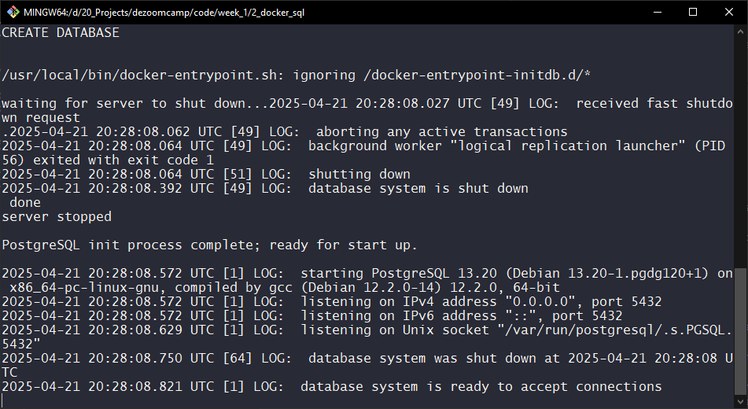
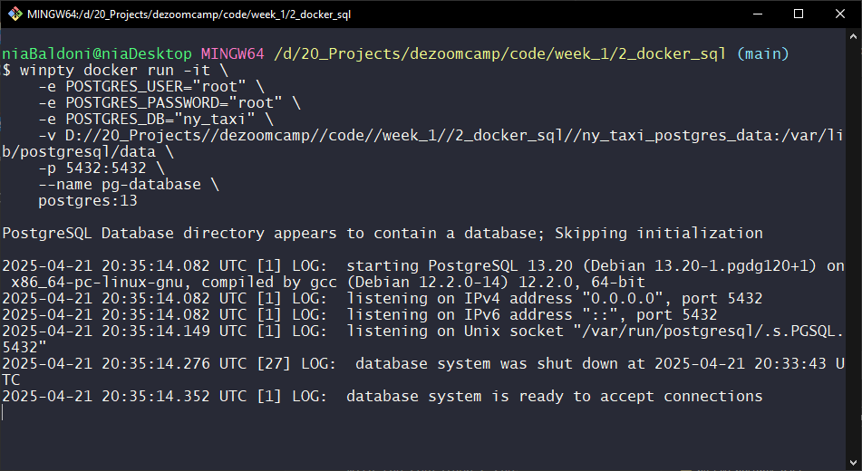
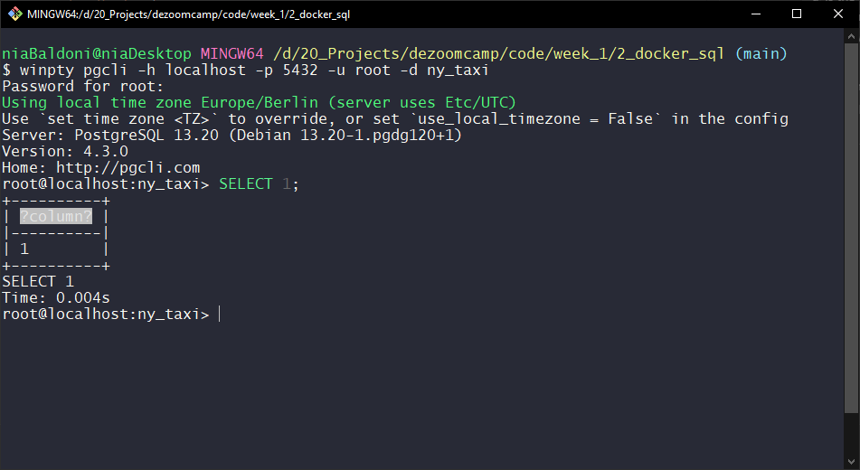
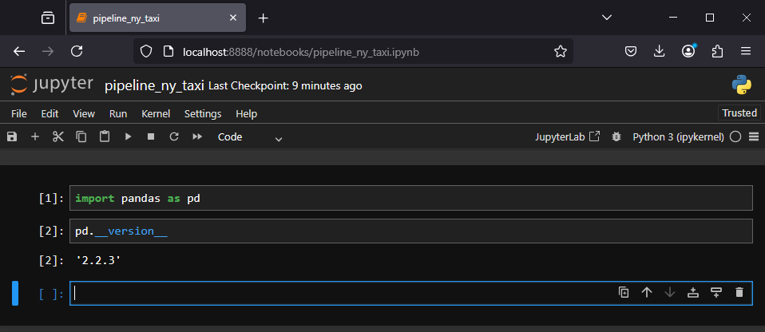
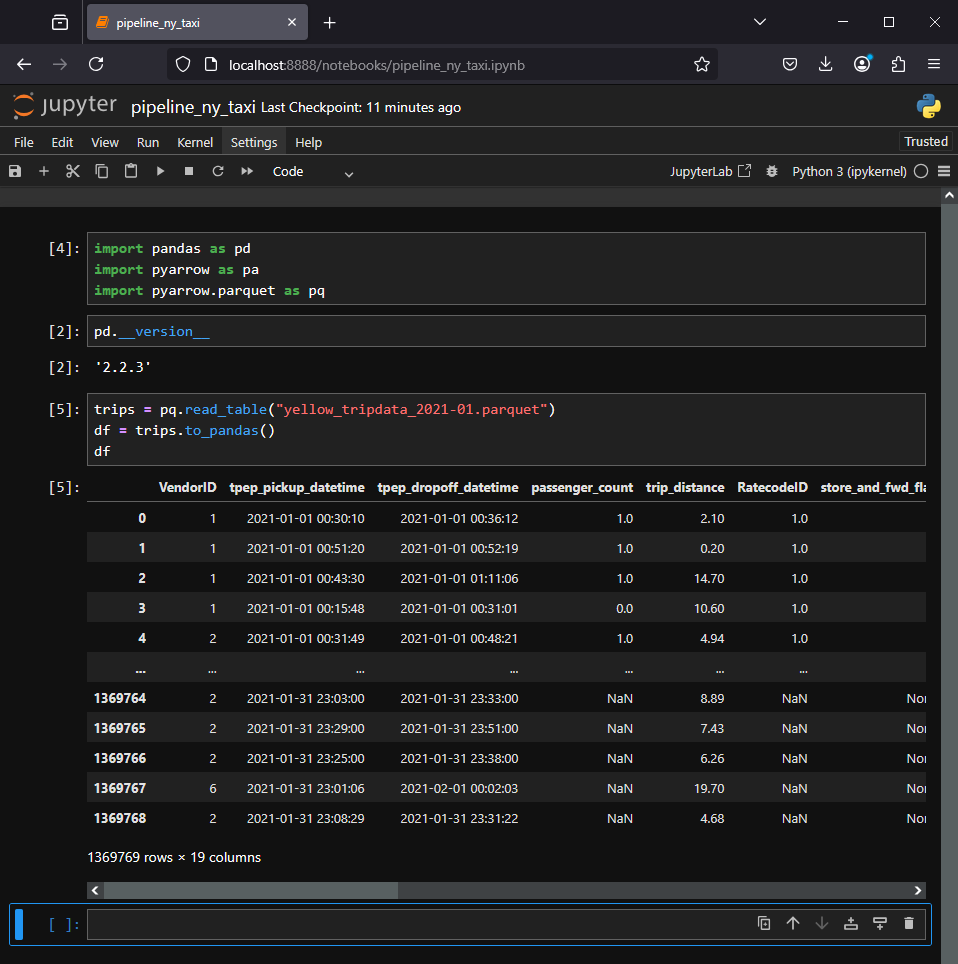
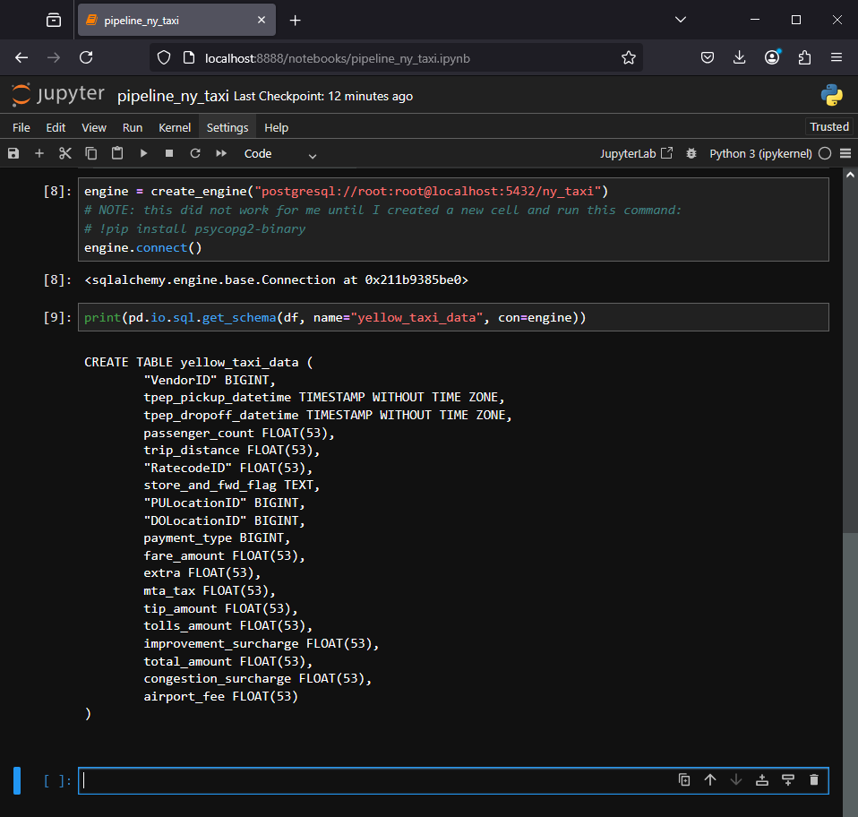
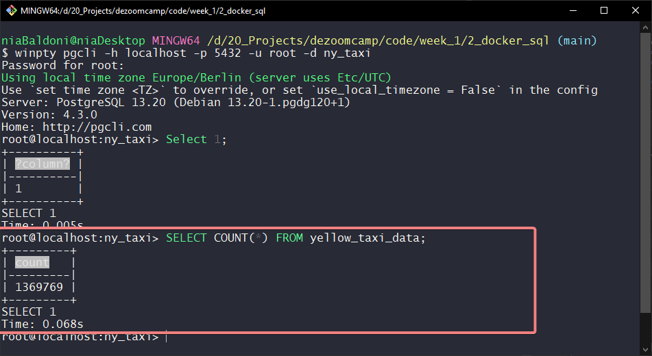

# 1.2.2 Ingesting NY Taxi Data to Postgres

In this session, we’ll walk through the essential components of a basic data pipeline: setting up a PostgreSQL database server using Docker, connecting to it with a PostgreSQL client (`pgcli`), and using Jupyter Notebook to ingest and load structured data into our database. This hands-on setup simulates a common real-world workflow and gives us a solid foundation in containerized environments, SQL-based data storage, and Python-driven data ingestion.

- [Setting up the PostgreSQL Server with Docker](#setting-up-the-postgresql-server-with-docker)
- [Setting Up a PostgreSQL Client with pgcli](#setting-up-a-postgresql-client-with-pgcli)
- [Setting Up Jupyter for Data Ingestion](#setting-up-jupyter-for-data-ingestion)
- [Finishing Touches](#finishing-touches)

## Setting up the PostgreSQL Server with Docker
To run a PostgreSQL 13 instance inside a Docker container on a Windows environment, we will use the following command:
```bash
winpty docker run -it \
    -e POSTGRES_USER="root" \
    -e POSTGRES_PASSWORD="root" \
    -e POSTGRES_DB="ny_taxi" \
    -v [...]code//week_1//2_docker_sql//ny_taxi_postgres_data:/var/lib/postgresql/data \
    -p 5432:5432 \
    --name pg-database \
    postgres:13
```

### Explanation of the parameters
- `winpty`: required on Windows to enable interactive terminal access in Docker.
- `-it`: runs the container in interactive mode, allowing direct interaction with the container's shell.
- `-e`: sets environment variables within the container:
    - `POSTGRES_USER`: the PostgreSQL user.
    - `POSTGRES_PASSWORD`: the user's password.
    - `POSTGRES_DB`: the name of the database.
- `-v`: mounts a volume from the host system to the container for data persistence:
    - `[...]code//week_1//2_docker_sql//ny_taxi_postgres_data` is the directory on my machine.
    - `/var/lib/postgresql/data` is the directory inside the container.
- `-p`: maps port 5432 of the host machine to port 5432 on the container, allowing access to the database from outside the container
- `--name`: assigns a custom name to the container.
- `postgres:13`: specifies the Docker image to use.

### Result
The Postgres Database was succesfully created and is now ready to accept connections.


### Note
Although the container is isolated, the PostgreSQL data is mounted to the path we specified. So, if we stop the container and run the command again, Docker will correctly recognize that the folder already contains the data.



## Setting Up a PostgreSQL Client with pgcli
Now that we have our server running, it's time to set up a new container that will act as our client. We'll open a new Git Bash window and install pgcli, a command-line interface for PostgreSQL.

```bash
    pip install pgcli
```

Once `pgcli` is installed, we can use the following command to try connecting to our database:

```bash
    winpty pgcli -h localhost -p 5432 -u root -d ny_taxi
```

Here's what each flag does:
- `-h` sets the hostname of our Postgres server (in this case, `localhost`)
- `-p` sets the port number (`5432`)
- `-u` is the username we're going to use to authenticate (`root`)
- Once again, `winpty` is needed to properly handle the interactive shell
If everything is set up correctly, we’ll successfully connect to the database and can start executing SQL commands.



At this point, the database is still empty, so running queries like `SELECT * FROM ...` won’t return much. But we can test the connection with something simple like `SELECT 1;`

This confirms that the client can send queries and the server responds as expected.

## Setting Up Jupyter for Data Ingestion

At this point, we have a server ready to store data and a client that can read from it. Now we need a way to move data from our dataset into the database we just set up. For this, we'll use Jupyter Notebook.

First, we install Jupyter by running:

```bash
    pip install jupyter
```

Once installed, we can start the Jupyter Notebook editor with:

```bash
    jupyter notebook
```

This will open the interface in my browser. Let’s create a new notebook and run a few test commands to make sure everything is working as expected.



Next, let’s take a look at the dataset we’ll be working with. The links can be found in the official [dezoomcamp repository](https://github.com/DataTalksClub/data-engineering-zoomcamp/tree/main/01-docker-terraform/2_docker_sql#ny-trips-dataset).

Note: The original project used `.csv` files, but the official source now provides the data in `.parquet` format. The DataTalksClub still hosts the original `.csv` files, but I chose to use the `.parquet` format instead to get some hands-on practice with the pyarrow library.

If everything is set up correctly, we should be able to load our data into a Pandas DataFrame.



Once the data is loaded into Pandas, the next step is to move it into our Postgres database. To do that, we first need to establish a connection.

We’ll use create_engine from SQLAlchemy (don't forget to add the import in the first cell). With our connection details, we can connect to the Postgres container running in Docker, and we can generate the SQL schema in Postgres by using the column names and data types from our DataFrame.



At this point, we hit another challenge: we could try inserting over 1.3 million rows at once... but it's more efficient to insert the data in batches.

Since we’re working with a `.parquet` file, I wrote some code to account for the format differences and handle the batching process.

## Finishing Touches

And we’re done! We've successfully read data from a `.parquet` file and written it to a Postgres database… or did we?

Let’s verify that the data was actually saved. We'll go back to our client terminal (Git Bash) and check which tables exist in the ny_taxi database, and how many rows have been inserted.



:D Success! The data has been loaded into Postgres!