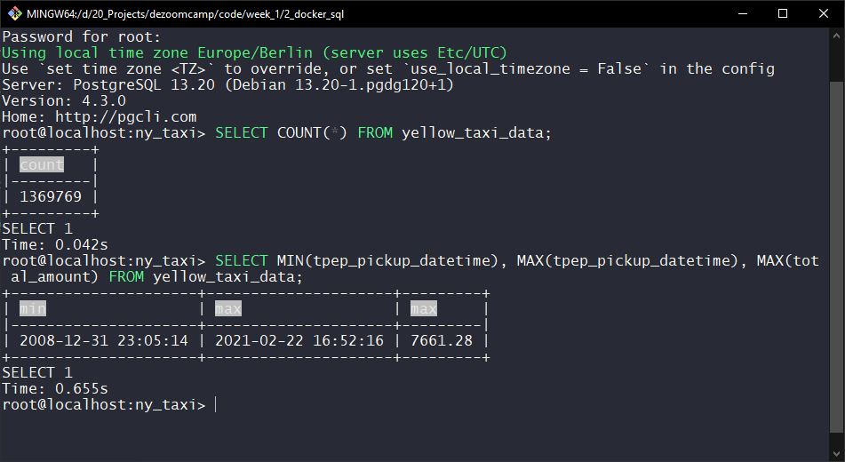
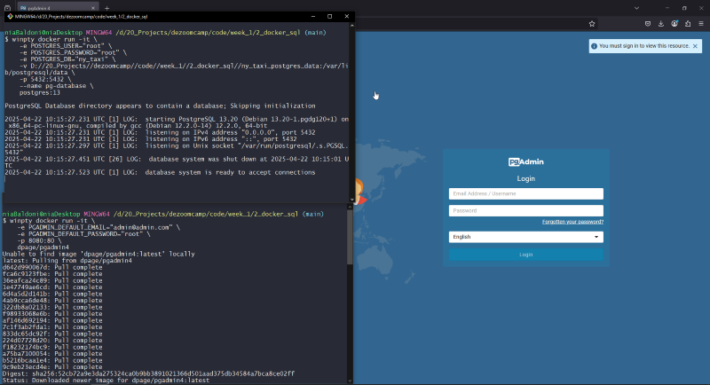
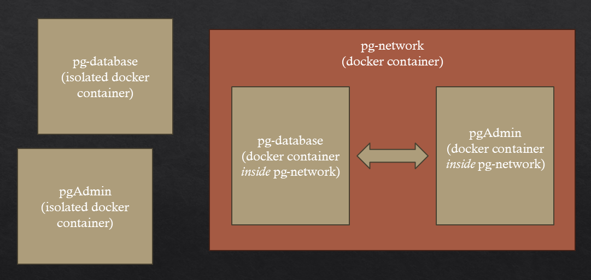
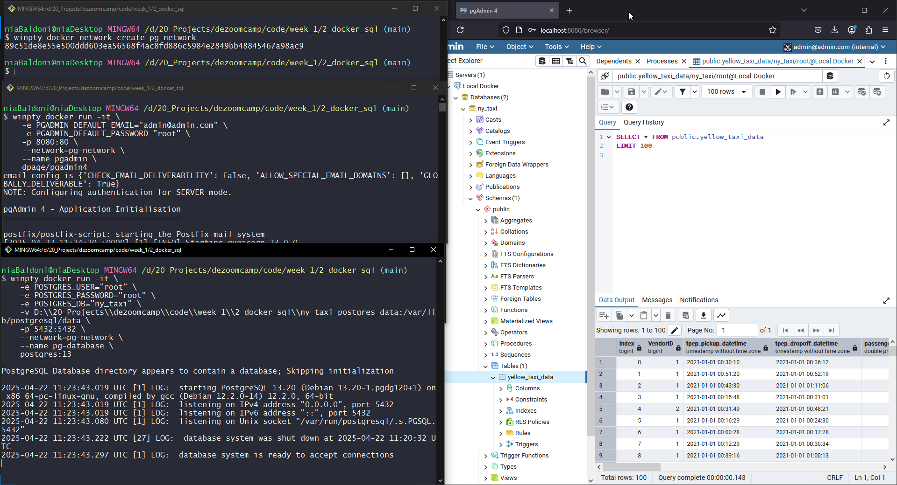

# Connecting pgAdmin and Postgres
In this section, we explore how to connect a PostgreSQL server and a pgAdmin client using Docker. We start by analyzing the data via SQL, then move to a GUI with pgAdmin, and finally resolve container isolation by setting up a shared Docker network for seamless communication.

- [Exploring the data, but... how?](#exploring-the-data-but-how)
- [pgAdmin](#pgadmin)
- [Docker containers](#docker-containers)
- [Setting up the Docker network](#setting-up-the-docker-network)

## Exploring the data, but... how?

Now that we have loaded the data, we can explore it a little bit. For example, we can see the datetime for the first pickup contained in the database, the date for the last pickup, and the maximum amount ever paid.



$7,000?! That must’ve been *some* ride. Whether this is a real fare or a data entry error isn't immediately clear—we’d need to analyze the dataset further to decide if extreme values like this should be treated as outliers and excluded from analysis.

The fact that this dataset is supposed to contain only trips made in January 2021, while both the earliest and latest trip recorded in the dataset seems to have taken place in December 2008 and February 2021, does seem to indicate the dataset needs to be cleaned a bit.

While using the terminal is powerful, it’s not always the most user-friendly way to interact with a database. Let’s improve our setup by running pgAdmin (a web-based PostgreSQL client) inside a Docker container.

## pgAdmin

We can launch pgAdmin with the following command:

```bash
winpty docker run -it \
    -e PGADMIN_DEFAULT_EMAIL="admin@admin.com" \
    -e PGADMIN_DEFAULT_PASSWORD="root" \
    -p 8080:80 \
    dpage/pgadmin4
```

After running this command in a new Git Bash terminal, you should see the pgAdmin web interface open in your browser:



However, if we try to connect to the PostgreSQL server from pgAdmin, we'll run into a problem: the pgAdmin container can’t see the PostgreSQL server container. That’s because each container runs in its own isolated environment by default.

To allow containers to talk to each other, we need to create a custom Docker network and run both containers within it.

## Docker containers

By default, Docker containers are isolated from each other — think of them like separate boxes that can’t communicate. Even though we have a PostgreSQL server container and a pgAdmin client container, they can’t talk to each other unless we explicitly connect them. 

To solve this, we can create a Docker network — a shared environment where containers can interact. Once both containers are launched within the same network, they can "see" each other and communicate as if they were on the same local network. The image below illustrates this concept: isolated containers on the left, and both containers connected inside a shared pg-network on the right.




## Setting up the Docker network

We will now stop any running containers, then create the network:

```bash
winpty docker network create pg-network
```

Now we re-run our containers, this time adding both a `--name` for easier reference and `--network=pg-network` so they join the same virtual network.

Run the PostgreSQL server:

```bash
    winpty docker run -it \
        -e POSTGRES_USER="root" \
        -e POSTGRES_PASSWORD="root" \
        -e POSTGRES_DB="ny_taxi" \
        -v [...]code\\week_1\\2_docker_sql\\ny_taxi_postgres_data:/var/lib/postgresql/data \
        -p 5432:5432 \
        --network=pg-network \
        --name pg-database \
        postgres:13
```

Run the PgAdmin container:

```bash
    winpty docker run -it \
        -e PGADMIN_DEFAULT_EMAIL="admin@admin.com" \
        -e PGADMIN_DEFAULT_PASSWORD="root" \
        -p 8080:80 \
        --network=pg-network \
        --name pgadmin \
        dpage/pgadmin4
```

And now that both containers are on the same network, pgAdmin can successfully connect to the PostgreSQL server.

