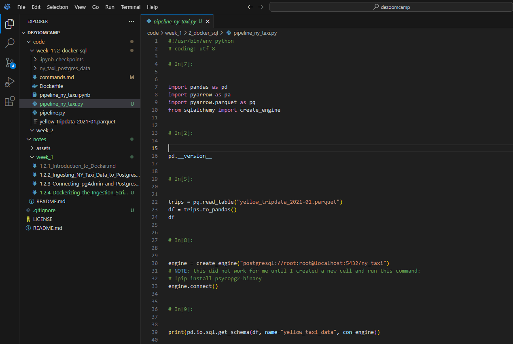
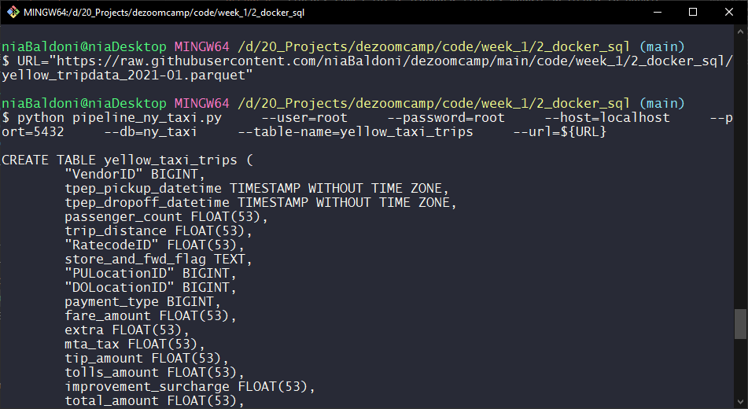

# Dockerizing the Ingestion Script

Before moving on, we take a quick detour to clean up our workflow. Instead of using a Jupyter Notebook to load data into Postgres, we refactor it into a flexible Python script, then containerize it with Docker for a fully reproducible pipeline that loads the data into Postgres.

- [Exporting the notebook to a Python script](#exporting-the-notebook-to-a-python-script)
- [Making the Script Flexible with `argparse`](#making-the-script-flexible-with-argparse)
- [Testing the Python Ingestion Script Locally](#testing-the-python-ingestion-script-locally)
- [Dockerizing the Ingestion Script](#dockerizing-the-ingestion-script-1)

## Exporting the notebook to a Python script

We can quickly export the notebook into a Python script using Jupyter built in methods.

```bash
    jupyter nbconvert --to=script pipeline_ny_taxi.ipynb
```

Here's the resulting pipeline_ny_taxi.py file:



As we can see, the script needs to be cleaned up a bit! We're going to do just that.

## Making the Script Flexible with `argparse`

To turn the Jupyter-based code into a reusable data ingestion tool, we make the script configurable via command-line arguments. This is where Python’s `argparse` library comes in: a standard library module designed to handle command-line inputs in a structured way.

We define a `main()` function that receives a `params` object, which will contain all the arguments passed in from the command line. We use those arguments to define where to get the data from, and to build a connection to the Postgres database.

This approach makes the script reusable across different environments and data sources. Instead of hardcoding values, we can now pass in parameters when running the script, whether that’s manually from the command line or from within a Docker container.

My cleaned up script can be found in the code folder, or by [clicking this link](../../code/week_1/2_docker_sql/pipeline_ny_taxi.py).

## Testing the Python Ingestion Script Locally

With the script now accepting command-line arguments via argparse, we can test it locally by running it with real parameters. We first set the Data URL:

```bash
    URL="https://raw.githubusercontent.com/niaBaldoni/dezoomcamp/main/code/week_1/2_docker_sql/yellow_tripdata_2021-01.parquet"
```

Next, we run the Python script and pass in all the required parameters.

```bash
    python pipeline_ny_taxi.py \
    --user=root \
    --password=root \
    --host=localhost \
    --port=5432 \
    --db=ny_taxi \
    --table-name=yellow_taxi_trips \
    --url=${URL}
```

The script will take a bit to complete as it will have to download the data from the internet (until now, we've worked with a local download of the file).But, eventually, the console should start showing the "Finished another chunk" logging messages, and the ingestion script will succesfully complete.



We had previously dropped our existing table to test the new script. If we access our PgAdmin dashboard again, we can see that the table has now been created again with all the rows.

This proves the ingestion pipeline works as a standalone script, and we're ready to containerize it with Docker in the next step.

## Dockerizing the Ingestion Script

We're almost done: we are now going to containerize this script using Docker so that we can encapsulate all dependencies and make our ingestion workflow reproducible and portable.

We configure our `Dockerfile`. This image is based on the official `python:3.9` image and installs all the necessary libraries for our [ingestion script](../../code/week_1/2_docker_sql/pipeline_ny_taxi.py).

```dockerfile
FROM python:3.9

RUN pip install argparse pyarrow pandas sqlalchemy psycopg2-binary requests

WORKDIR /app

COPY pipeline_ny_taxi.py pipeline_ny_taxi.py

ENTRYPOINT [ "python", "pipeline_ny_taxi.py" ]
```

Then, we build this image using:

```bash
    docker build -t taxi_ingest:v001 .
```

After once again dropping our table in the database (we don't want to risk conflicts or problems), we run this Docker container:

```bash
    URL="https://raw.githubusercontent.com/niaBaldoni/dezoomcamp/main/code/week_1/2_docker_sql/yellow_tripdata_2021-01.parquet"

    winpty docker run -it \
        --network=pg-network \
        taxi_ingest:v001 \
            --user=root \
            --password=root \
            --host=pg-database \
            --port=5432 \
            --db=ny_taxi \
            --table-name=yellow_taxi_trips \
            --url=${URL}
```

### Notes: 
- We set `--network=pg-network` so that this container is in the same Docker network as the Postgres container, enabling communication between them.
- Inside Docker, `localhost` doesn’t refer to the host machine. Instead, we simply set `--host=pg-database` (the name of the Postgres container) to connect, thanks to Docker's internal DNS resolution within a shared network.

With everything wired up, the data is successfully ingested into Postgres from inside the container: we now have a fully Dockerized version of our ingestion pipeline!