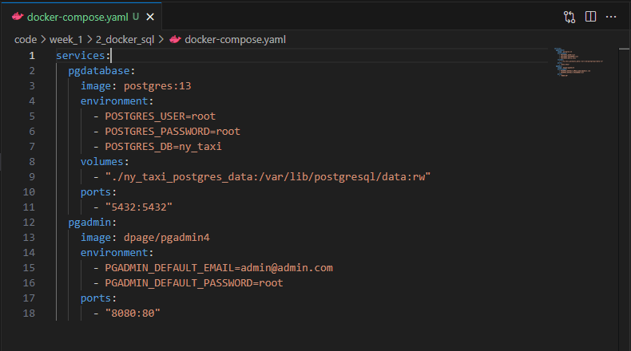

# Running Postgres and pgAdmin with Docker-Compose

Now that we’ve Dockerized our ingestion script, we simplify the Postgres and pgAdmin setup using Docker Compose. This tool allows us to configure multiple Docker containers in a single YAML file, making it easier to manage related services.

## Why Docker Compose?

Previously, we ran Postgres and pgAdmin using individual `docker run` commands, passing lots of flags for ports, volumes, and environment variables. This can quickly become unmanageable, especially when working with more than one container.

Docker Compose solves this by consolidating everything into one file (`docker-compose.yaml`), where we define each service and its configuration. It also automatically creates a shared Docker network, so services can communicate with each other by name (e.g. `pg-database`).

## Creating a Configuration File

We begin by creating a [`docker-compose.yaml`](../../code/week_1/2_docker_sql/docker-compose.yaml) file in our project.



### Notes

- `services:` defines the containers (e.g. `pgdatabase`, `pgadmin`)
- `environment:` sets variables, like credentials and database name
- `volumes:` mounts local folders into containers for persistent storage; in this case, we don't need the full path like in the previous examples
- `ports:` exposes container ports to the host

## Running the services

With the config file in place, we run the entire setup using:

```bash
    docker-compose up
```

Docker Compose automatically pulls images if needed, sets up a network, and launches the containers. Once everything is running, we can visit `http://localhost:8080` to access pgAdmin.