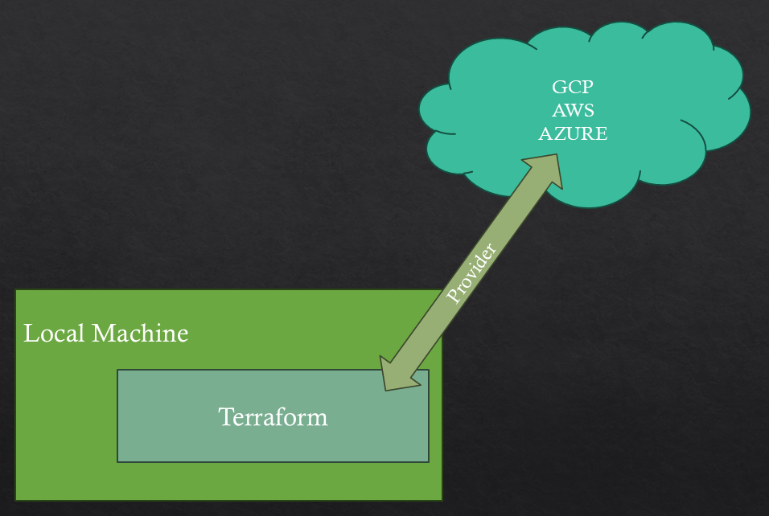

# Terraform Primer 

Like "terraforming" a planet, Terraform creates conditions for code and software to run by setting up infrastructure (cloud or local). It's an Infrastructure as Code (IaC) tool to define, provision, and manage cloud/on-prem resources through human-readable config files (that you can version, reuse, and share).

## Why use Terraform
- Simplicity: Infrastructure described in readable files; easy to review and tweak.
- Collaboration: Files can be stored in Git; teams can collaborate, review, and update before applying.
- Reproducibility: Build infrastructure once, re-deploy elsewhere (e.g., dev to prod) or share projects with friends.
- Cleanup: Easily destroy resources after use to avoid ongoing cloud costs.

## What Terraform Is NOT
- Not for managing or updating code/software on servers.
- Cannot change immutable resources (e.g., changing a VM type means destroy and recreate).
- Does not manage resources created outside your Terraform files.
- Focuses only on managing infrastructure as described in your code files.

## How Terraform Works

- Local Machine: You install Terraform locally.
- Provider: Specifies the cloud platform (AWS, GCP, Azure, etc.).
- Authorization: You must authenticate (e.g., service account, token).

Terraform uses the provider to talk to your cloud platform and provision resources.

## Key Terraform Commands

| Command | Purpose |
|---|---|
| `terraform init` | Downloads provider code and prepares your project. |
| `terraform plan` | Shows what will happen (preview of infrastructure changes). |
| `terraform apply` | Actually creates the infrastructure defined in the .tf files. |
| `terraform destroy` | Removes all infrastructure defined in your Terraform files. |